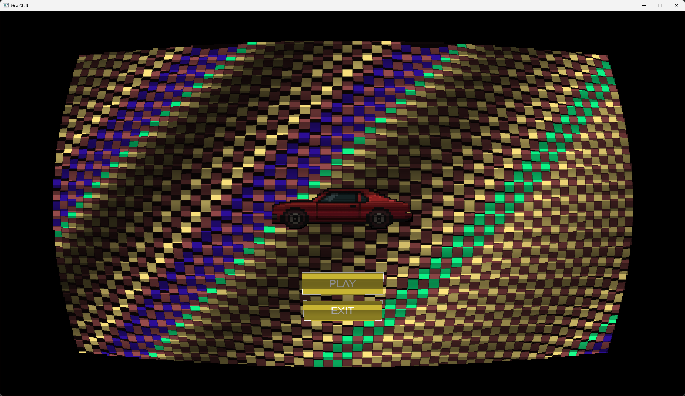
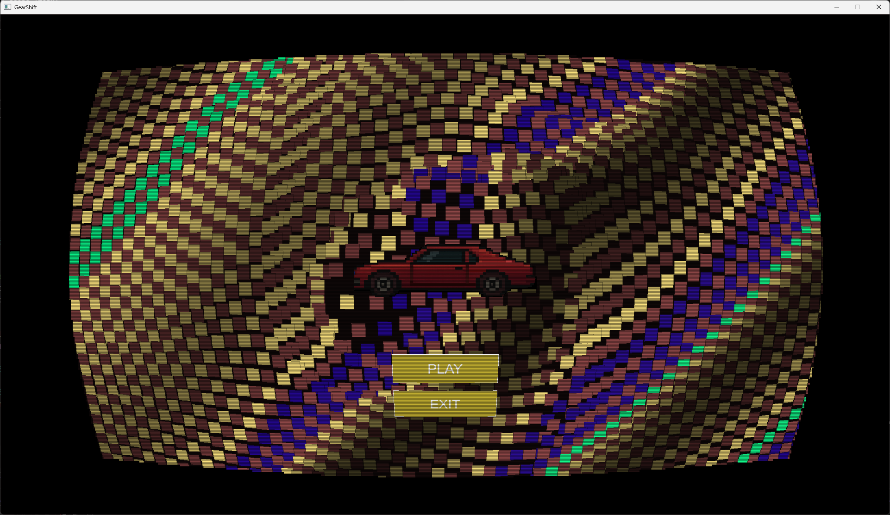
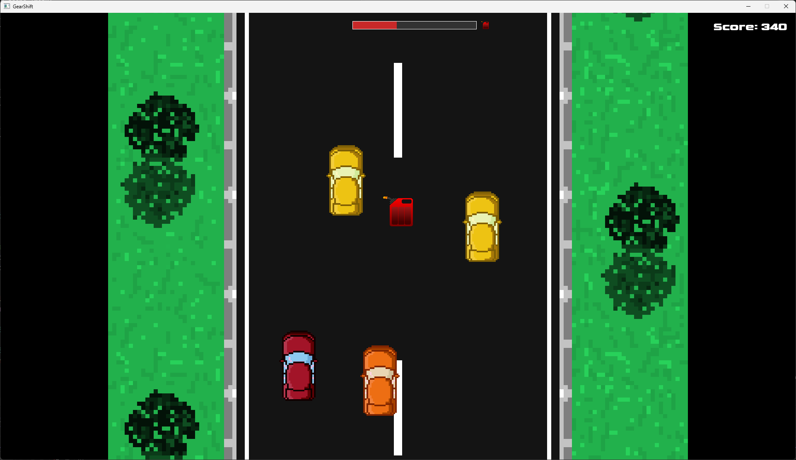
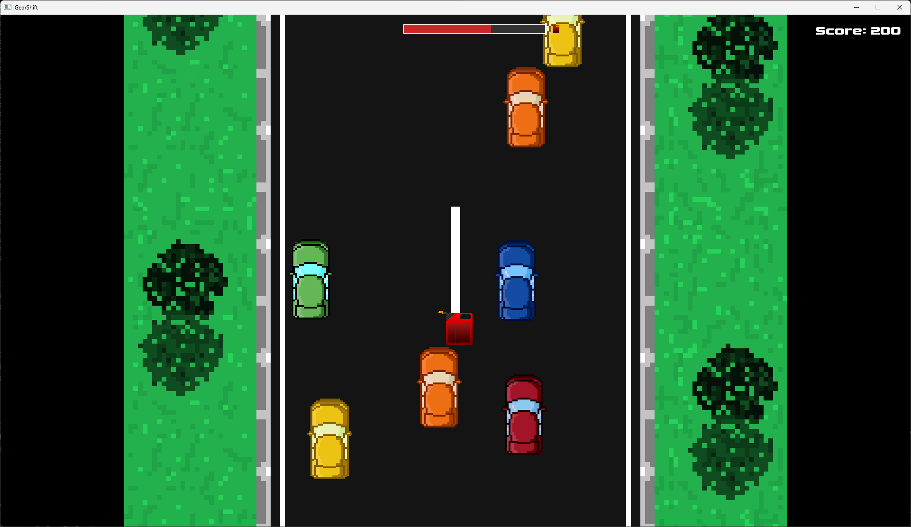
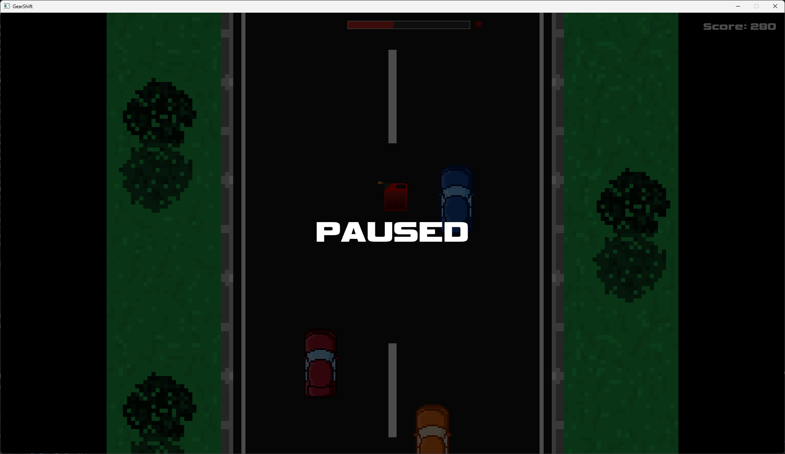
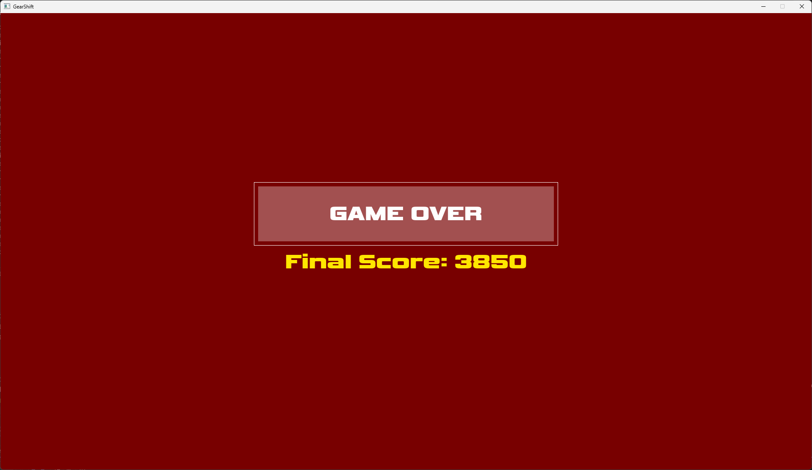

# GearShift
### **Don't scratch the car, but drive it like you stole it!**

#### A 2D game in which you drive a car on a road, avoiding other cars or... crashing into them.


## Special Thanks To:
- **Straton Andre Antonio** for the **outstanding interactive menu**, and contribution to game logic and diagrams.
- **Sava Stefan-Cristian** for the **immersive** and **intuitive** **game engine** mechanics, **natural object interaction**, **scalable architecture**, **infinite gameplay** and contribution to sprites, UI and diagrams. 
- **Rotar Robert** for the **addictive player movement**, **rewarding fuel and score systems**, and **efficient sprite management**.

## Controls:
- For **menu** interaction use the mouse. Left-click interacts with the menu's moving background
- In Game: **WASD** or **Arrow-Keys** to **control the car**. **ESC** to **pause/resume** game 

## Technologies
- **SDL2** for UI
- **GTest** nad **GMock** for testing
- Language used: **C++**

### System requirements
- #### For **60 fps**: a decent (as of the year 2025) integrated graphics card or a dedicated graphics card. 
- #### For **>60 fps** we recommend a dedicated graphics card.

#### What follows are all in-game screenshots:

<div style="
    display: flex;
    flex-direction: row;
    flex-wrap: wrap;
    justify-content: center;
    gap: 10px;">
    
    
    
    
    
    
</div>


## Setup

1. Clone this Repository
2. From vcpkg run:
```
vcpkg install sdl2 sdl2-image sdl2-ttf
vcpkg integrate install
```
###### You may need to use `./` or `.\` before the command on Windows
3. If Visual Studio doesn't find the NuGet packages, they may require manual installation
4. If vcpkg didn't integrate with Visual Studio and it can't find header files or libraries, adding the paths manually in Visual Studio may be required.

### If you don't have `vcpkg` already:

1. Clone `vcpkg` (Can be found on GitHub at `github.com/microsoft/vcpkg`)
2. Run `bootstrap-vcpkg.bat` -> This will create `vcpkg.exe` in the directory
3. To run vcpkg commands, open the directory where it is in `cmd`, and you can run commands like `./vcpkg install sdl2`

# Legal Disclaimer
* **We do not own *the entirety* of the images and textures used in this project.**

###### Easter-Egg: Traffic Cars will stop if you stop in front of them.